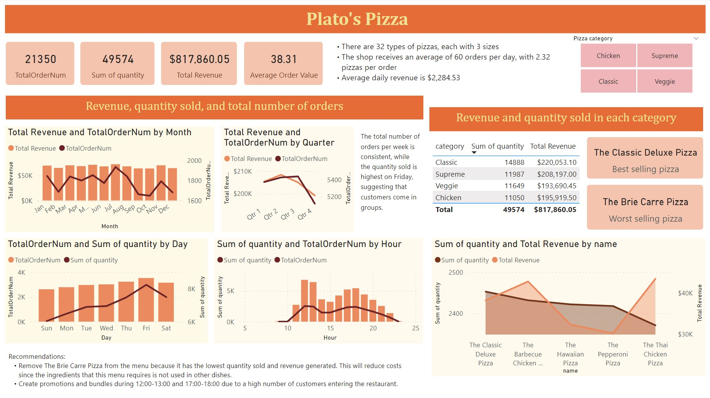

# 🍕 Restaurant Dashboard

## Introduction
I analyzed a dataset of a fictitious restaurant’s sales and orders to make recommendations for the store. The dataset included 4 sheets: order IDs, order details, pizza menu, and pizza details which has the name of the pizza, its category, and ingredients in it. **I used Power BI for this analysis.**

This dataset was taken from [Maven Analytics](https://mavenanalytics.io/challenges/maven-pizza-challenge/be511a47-85fd-4931-8293-c3bffb577199).
## Analysis
First, I examined the overview of total orders, total quantity of pizza sold, total revenue, and average order. 

Next, I studied the trend of revenue, number of orders, quantity of pizza sold. I extracted the quarters, months, days, and hours and plotted them against these 3 measures to see the period where revenue, orders, and quantity sold were highest. 

Third, I identified the best and worst performing pizza in terms of revenue and quantity sold. 

In conclusion, the pizza place earns the highest revenue around the second quarter and has the most orders in the third quarter. Orders are highest during Friday and during 12-1 pm and 5-6 pm. The store is recommended to create promotions and bundle during this period due to the high number of customers to increase sales. The restaurant sells 4 categories of pizza, with the classic being the best selling. Lastly, The Brie Carre Pizza should be removed from menu due to its low sales.
